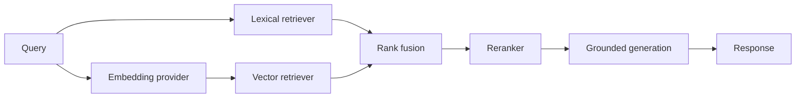

# Architecture

## Implemented Now: Phases 1, 2, and 3

- `core.config.Settings` owns typed application settings. Environment variables prefixed with `SUPPORT_ASSISTANT_` override development defaults; a local `.env` is read through `pydantic-settings`.
- `main.create_app()` is the application factory. It receives settings and an optional LLM provider, configures logging, mounts routers, and registers API exception handlers. No model is created at import time.
- The health route is intentionally fast and checks only that the API process is serving requests.
- Request context middleware accepts a syntactically valid UUID `X-Request-ID`, otherwise creates one, binds it to structured logs, and returns it on every HTTP response.
- Application exceptions have a stable JSON error envelope. Unexpected exceptions are logged server-side and return a generic message.
- Provider and retriever protocols describe the future integration points. There are no vendor-specific clients or retrieval algorithms in this phase.
- FAQ Pydantic schemas are separate from SQLAlchemy 2.x models. One `faqs` row keeps question and answer together as an atomic knowledge item, with metadata, tags, status, timestamps, and a deterministic duplicate key.
- The async session factory uses the configured URL. FastAPI dependencies own request-scoped transactions; application startup does not create tables or connect to the database. Alembic owns schema changes.
- `FAQRepository` is the persistence contract; `SqlAlchemyFAQRepository` is its implementation. `KnowledgeBaseService` coordinates create/list/get/update/deactivate and ingestion without depending on SQLAlchemy query construction.
- JSON and JSONL loaders feed per-record validation and normalization. A malformed record is reported and skipped while valid records in the same batch continue.
- FAQ duplicate identity is normalized question + product + version, case-insensitive. The first normalized occurrence in a batch wins; records already in storage are counted as duplicates and not rewritten. A database unique key also protects this identity.
- `EvaluationExample` and its JSONL loader support stable query IDs, multiple relevant FAQ IDs, metadata, difficulty, and notes. Invalid lines, duplicate query IDs, and references missing from the active corpus are reported as structured diagnostics.
- Retrieval documents are deterministic projections of active persisted FAQs: one FAQ maps to one document containing question + answer. Metadata is retained but is not added to indexed text or used for automatic filtering.
- `BM25Retriever` builds an in-memory BM25Plus index once. Results are ordered by score then FAQ ID for deterministic ties. BM25 values are lexical ranking scores, not probabilities.
- `SentenceTransformerEmbeddingProvider` implements the replaceable embedding contract and loads `sentence-transformers/all-MiniLM-L6-v2` only when explicitly constructed. The model is a small CPU-friendly initial baseline, not a selected final model.
- `FAISSVectorIndex` builds a reusable `IndexFlatIP` over L2-normalized vectors. Its returned score is cosine similarity (in [-1, 1]), not a probability. Index order is explicitly mapped to sorted FAQ IDs and tied scores are then ordered by FAQ ID.
- Document embeddings can be cached as local `.npz` arrays keyed by the model identifier and ordered FAQ IDs/content. Query embeddings are not cached. Model loading, document/index build, and per-query search timing are separate; vector per-query latency includes query embedding plus index search.
- The retriever-agnostic evaluator computes Recall@1/3/5, MRR, configurable Hit Rate@K, mean/p50/p95 query latency, and query-ID-only miss/confusion diagnostics. Recall@K is the fraction of all relevant FAQs retrieved within K, averaged across valid queries. MRR uses the first relevant rank. Invalid dataset rows and out-of-corpus relevance IDs are reported, not silently counted as misses.

## Planned Later

The intended future retrieval flow is:

The Phase 3 independent baselines feed separate evaluation runs. RRF, reranking, evidence selection, generation, confidence, and abstention remain future work. No retrieval HTTP endpoint has been added.

## Swappable Components

- `generation.providers.LLMProvider` returns a typed `GenerationResult`; local Ollama, hosted providers, and other models can implement the same async `generate` contract.
- `retrieval.embeddings.EmbeddingProvider` separates document and query embedding operations from any concrete embedding model.
- `retrieval.bm25_search.LexicalRetriever` and `retrieval.vector_search.VectorRetriever` return common `RetrievalCandidate` values. The semantic text adapter owns query embedding while the FAISS index accepts vectors, keeping model selection separate from index storage.
- `retrieval.reranker.Reranker` reorders common candidates without depending on a particular reranking model.
- `Settings` centralizes provider, model, and top-K selections. Phase 1 uses `not-configured` placeholders and does not choose or load models.

Implementations can therefore change through configuration and dependency injection without changing evaluation logic or route handlers. Contracts are intentionally narrow.

## Phase 2 Ingestion Behavior

`POST /knowledge-base/faqs/bulk` accepts at most 1,000 JSON FAQ records; file ingestion is kept in the CLI, not exposed as an upload endpoint. The CLI accepts UTF-8 `.json` arrays or `.jsonl` files. A malformed JSONL line becomes a structured validation error and does not stop other records; invalid JSON documents and unsupported encodings fail the file load.

Whitespace at field edges is trimmed; runs of whitespace within each question/answer line are collapsed while paragraph breaks are retained. Empty metadata becomes null, and tags are trimmed and deduplicated case-insensitively. Invalid records are never silently discarded: the result includes record number, field, code, and a safe message. `accepted_records` counts valid records, including duplicates; `rejected_records` counts validation errors; duplicates are reported separately. Ingestion persists new valid records together in the request/CLI transaction.

## Phase 3 Evaluation Semantics

Recall@K for a query is `|relevant IDs intersect retrieved top K| / |all known relevant IDs|`; the dataset is filtered to valid references before evaluation. Mean Recall@K averages query recall. Hit Rate@K is the fraction of valid queries with at least one relevant result in top K; it is reported with its K so it is not ambiguous. MRR averages the reciprocal rank of each query's first relevant result, assigning zero when none is retrieved.

Latency measures each retriever call. BM25 includes tokenization and search. Vector includes query embedding and FAISS search. Model initialization and corpus embedding/index construction are reported separately and are not included in per-query latency. Synthetic results are not evidence for production model quality; build a 100-300 query golden dataset before comparing or selecting final models.

`BM25Plus` is used because standard Okapi negative IDF can invert ranking for small FAQ corpora. The initial semantic baseline is `sentence-transformers/all-MiniLM-L6-v2`, chosen for practical local CPU evaluation and reproducibility only. Its 384-dimensional embedding and FAISS inner-product index over normalized vectors yield cosine similarity. Neither score type is a probability, and lexical scores are never compared numerically to cosine scores.

No RRF, reranker, LLM, confidence, automatic abstention, frontend, or production vector database is implemented in Phase 3.
