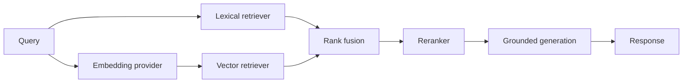

# Architecture

## Implemented Now

- `core.config.Settings` owns typed application settings. Environment variables prefixed with `SUPPORT_ASSISTANT_` override development defaults; a local `.env` is read through `pydantic-settings`.
- `main.create_app()` is the application factory. It receives settings and an optional LLM provider, configures logging, mounts routers, and registers API exception handlers. No model is created at import time.
- The health route is intentionally fast and checks only that the API process is serving requests.
- Request context middleware accepts a syntactically valid UUID `X-Request-ID`, otherwise creates one, binds it to structured logs, and returns it on every HTTP response.
- Application exceptions have a stable JSON error envelope. Unexpected exceptions are logged server-side and return a generic message.
- Provider and retriever protocols describe the future integration points. There are no vendor-specific clients or retrieval algorithms in this phase.
- The `db/` package remains reserved for a later persistence design; it has no database behavior yet.

## Planned Later

The intended retrieval flow is:

Lexical search, vector search, fusion, reranking, persistence, and generation will be implemented behind testable service boundaries in later phases. The API layer will depend on application services, not on the chosen algorithm or provider.

## Swappable Components

- `generation.providers.LLMProvider` returns a typed `GenerationResult`; local Ollama, hosted providers, and other models can implement the same async `generate` contract.
- `retrieval.embeddings.EmbeddingProvider` separates document and query embedding operations from any concrete embedding model.
- `retrieval.bm25_search.LexicalRetriever` and `retrieval.vector_search.VectorRetriever` return common `RetrievalCandidate` values. The vector contract receives an embedding, leaving model selection separate from vector storage.
- `retrieval.reranker.Reranker` reorders common candidates without depending on a particular reranking model.
- `Settings` centralizes provider, model, and top-K selections. Phase 1 uses `not-configured` placeholders and does not choose or load models.

Implementations can therefore change through configuration and dependency injection without changing business logic or route handlers. Contracts are intentionally narrow; orchestration and persistence boundaries will be introduced when those behaviors are implemented.
