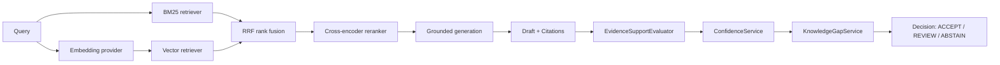

# Architecture

## Implemented Now: Phases 1-7

- `core.config.Settings` owns typed application settings. Environment variables prefixed with `SUPPORT_ASSISTANT_` override development defaults; a local `.env` is read through `pydantic-settings`.
- `main.create_app()` is the application factory. It receives settings and an optional LLM provider, configures logging, mounts routers, and registers API exception handlers. No model is created at import time.
- The health route is intentionally fast and checks only that the API process is serving requests.
- Request context middleware accepts a syntactically valid UUID `X-Request-ID`, otherwise creates one, binds it to structured logs, and returns it on every HTTP response.
- Application exceptions have a stable JSON error envelope. Unexpected exceptions are logged server-side and return a generic message.
- Provider and retriever protocols describe the future integration points. There are no vendor-specific clients or retrieval algorithms in this phase.
- FAQ Pydantic schemas are separate from SQLAlchemy 2.x models. One `faqs` row keeps question and answer together as an atomic knowledge item, with metadata, tags, status, timestamps, and a deterministic duplicate key.
- The async session factory uses the configured URL. FastAPI dependencies own request-scoped transactions; application startup does not create tables or connect to the database. Alembic owns schema changes.
- `FAQRepository` is the persistence contract; `SqlAlchemyFAQRepository` is its implementation. `KnowledgeBaseService` coordinates create/list/get/update/deactivate and ingestion without depending on SQLAlchemy query construction.
- JSON and JSONL loaders feed per-record validation and normalization. A malformed record is reported and skipped while valid records in the same batch continue.
- FAQ duplicate identity is normalized question + product + version, case-insensitive. The first normalized occurrence in a batch wins; records already in storage are counted as duplicates and not rewritten. A database unique key also protects this identity.
- `EvaluationExample` and its JSONL loader support stable query IDs, multiple relevant FAQ IDs, metadata, difficulty, and notes. Invalid lines, duplicate query IDs, and references missing from the active corpus are reported as structured diagnostics.
- Retrieval documents are deterministic projections of active persisted FAQs: one FAQ maps to one document containing question + answer. Metadata is retained but is not added to indexed text or used for automatic filtering.
- `BM25Retriever` builds an in-memory BM25Plus index once. Results are ordered by score then FAQ ID for deterministic ties. BM25 values are lexical ranking scores, not probabilities.
- `SentenceTransformerEmbeddingProvider` implements the replaceable embedding contract and loads `sentence-transformers/all-MiniLM-L6-v2` only when explicitly constructed. The model is a small CPU-friendly initial baseline, not a selected final model.
- `FAISSVectorIndex` builds a reusable `IndexFlatIP` over L2-normalized vectors. Its returned score is cosine similarity (in [-1, 1]), not a probability. Index order is explicitly mapped to sorted FAQ IDs and tied scores are then ordered by FAQ ID.
- Document embeddings can be cached as local `.npz` arrays keyed by the model identifier and ordered FAQ IDs/content. Query embeddings are not cached. Model loading, document/index build, and per-query search timing are separate; vector per-query latency includes query embedding plus index search.
- The retriever-agnostic evaluator computes Recall@1/3/5, MRR, configurable Hit Rate@K, mean/p50/p95 query latency, and query-ID-only miss/confusion diagnostics. Recall@K is the fraction of all relevant FAQs retrieved within K, averaged across valid queries. MRR uses the first relevant rank. Invalid dataset rows and out-of-corpus relevance IDs are reported, not silently counted as misses.
- `ReciprocalRankFusion` combines generic ranked candidate lists using `sum(1 / (rrf_k + rank))`; it never adds BM25 and cosine score values. Duplicate FAQs contribute once per input ranking and become a single fused candidate. Ties use FAQ ID order. BM25/vector failures propagate explicitly; hybrid does not silently degrade.
- `HybridRetriever` independently runs BM25Plus and vector search with separately configurable top-K values, then returns the bounded configurable RRF pool. Source rank metadata identifies the lexical and vector ranks.
- `CrossEncoderReranker` loads `cross-encoder/ms-marco-MiniLM-L6-v2` only when constructed and reuses that model. It scores `(query, question + answer)` pairs only for hybrid candidates, then orders solely by its own score. RRF score and source ranks remain metadata; scores are ranking values, not confidence or probabilities.
- `CrossEncoderRerankingRetriever` limits reranking to the configured hybrid candidate pool and returns the configured final top-K. Evaluation reports total per-query latency separately from reranker-only mean/p50/p95 and model-load time.
- `LLMProvider` remains the application-facing provider contract. `OllamaLLMProvider` is an isolated, explicitly constructed adapter selected only when settings name `ollama`; the default provider/model remain unconfigured, and unsupported providers fail rather than silently falling back. One provider client is reused across requests.
- `GenerationService` accepts a customer query and typed evidence, limits evidence to the configured final count (default 5), builds a versioned prompt, calls the provider with a finite timeout, validates structured JSON, and returns a typed draft. It does not retrieve, access persistence, score confidence, or decide abstention.
- `RetrievalGenerationService` composes the injected reranked retriever with the generation service. It resolves candidate FAQ IDs against the supplied active corpus and hands only the final reranked evidence to generation.
- `EvidenceItem` preserves the exact FAQ question/answer, source metadata, FAQ ID, reranker rank/stage/score, and retrieval trace metadata supplied to the model. Retrieval/reranker values remain ranking metadata, never confidence.
- The model returns answer text plus FAQ IDs only. The application rejects duplicate/unknown cited IDs and constructs `DraftCitation` values from the exact supplied evidence; it never accepts model-authored source labels. The draft also records all supplied evidence IDs/content, provider/model, latency, usage when present, evidence count, and prompt version.
- Prompt content explicitly treats query/evidence as data, asks for evidence-grounded facts and concise support prose, forbids unsupported claims and fabricated inline citations, and asks the model to state when supplied evidence is insufficient. This is an instruction, not an implemented confidence or abstention decision.
- `ConfidenceAssessment` domain model establishes a three-state decision hierarchy (`ACCEPT`, `REVIEW`, `ABSTAIN`). `ACCEPT` means safe to present as an agent draft; `REVIEW` indicates borderline evidence support requiring verification; `ABSTAIN` indicates insufficient evidence or unsupported claims.
- `HeuristicEvidenceSupportEvaluator` implements the pluggable `EvidenceSupportEvaluator` protocol to evaluate sentence-level answer grounding against evidence content, verify citation validity, and detect unsupported claims.
- `KnowledgeGapService` inspects the query, retrieved reranked evidence, and draft text to identify knowledge gaps (empty evidence, low reranker score below threshold, unmatched query terms, or draft refusal phrases) without executing retrieval or calling LLMs directly.
- `ConfidenceService` derives explainable confidence scores from measurable signals (reranker scores, candidate score margin, support score, citation validity, and knowledge gap checks). It NEVER uses LLM self-reported confidence.
- `Phase7DraftService` orchestrates the end-to-end pipeline from query retrieval through grounded generation and confidence evaluation, returning structured abstention results (`answer: None`, reason, citations, metadata) whenever evidence is insufficient.

## Retrieval-to-Draft Flow

The implemented retrieval-to-draft flow is:

RRF, reranking, grounded generation, evidence support evaluation, knowledge-gap detection, and confidence scoring are implemented as injectable services. Human review workflow, public endpoint wiring, and customer sending remain future work. No generation or retrieval HTTP endpoint has been added.

## Swappable Components

- `generation.providers.LLMProvider` returns a typed `GenerationResult`; Ollama is isolated behind the contract and other providers can be added without changing the generation service.
- `generation.grounding.EvidenceSupportEvaluator` provides a narrow evaluation contract; `HeuristicEvidenceSupportEvaluator` can be replaced with an NLI model or LLM judge.
- `services.knowledge_gap_service.KnowledgeGapService` isolates knowledge-gap rules from confidence logic and LLM providers.
- `retrieval.embeddings.EmbeddingProvider` separates document and query embedding operations from any concrete embedding model.
- `retrieval.bm25_search.LexicalRetriever` and `retrieval.vector_search.VectorRetriever` return common `RetrievalCandidate` values. The semantic text adapter owns query embedding while the FAISS index accepts vectors, keeping model selection separate from index storage.
- `retrieval.reranker.Reranker` receives the query, a bounded candidate sequence, and a FAQ-ID-to-document mapping; it has no database or HTTP dependency.
- `Settings` centralizes provider, model, top-K, threshold, and RRF rank-constant selections. Baseline model settings can be replaced without changing fusion, evaluation, or business logic.

Implementations can therefore change through configuration and dependency injection without changing evaluation logic or route handlers. Contracts are intentionally narrow.

## Phase 2 Ingestion Behavior

`POST /knowledge-base/faqs/bulk` accepts at most 1,000 JSON FAQ records; file ingestion is kept in the CLI, not exposed as an upload endpoint. The CLI accepts UTF-8 `.json` arrays or `.jsonl` files. A malformed JSONL line becomes a structured validation error and does not stop other records; invalid JSON documents and unsupported encodings fail the file load.

Whitespace at field edges is trimmed; runs of whitespace within each question/answer line are collapsed while paragraph breaks are retained. Empty metadata becomes null, and tags are trimmed and deduplicated case-insensitively. Invalid records are never silently discarded: the result includes record number, field, code, and a safe message. `accepted_records` counts valid records, including duplicates; `rejected_records` counts validation errors; duplicates are reported separately. Ingestion persists new valid records together in the request/CLI transaction.

## Phase 3 Evaluation Semantics

Recall@K for a query is `|relevant IDs intersect retrieved top K| / |all known relevant IDs|`; the dataset is filtered to valid references before evaluation. Mean Recall@K averages query recall. Hit Rate@K is the fraction of valid queries with at least one relevant result in top K; it is reported with its K so it is not ambiguous. MRR averages the reciprocal rank of each query's first relevant result, assigning zero when none is retrieved.

Latency measures each retriever call. BM25 includes tokenization and search. Vector includes query embedding and FAISS search. Model initialization and corpus embedding/index construction are reported separately and are not included in per-query latency. Synthetic results are not evidence for production model quality; build a 100-300 query golden dataset before comparing or selecting final models.

`BM25Plus` is used because standard Okapi negative IDF can invert ranking for small FAQ corpora. The initial semantic baseline is `sentence-transformers/all-MiniLM-L6-v2`, chosen for practical local CPU evaluation and reproducibility only. Its 384-dimensional embedding and FAISS inner-product index over normalized vectors yield cosine similarity. Neither score type is a probability, and lexical scores are never compared numerically to cosine scores.

## Phases 4-5 Retrieval Policy

RRF starts at `rrf_k=60`, a conventional rank-smoothing baseline, and sums rank contributions only. The initial candidate settings are BM25 20, vector 20, fused pool 20, final reranked top 5; these are configurable baselines, not tuned optima. The RRF pool is bounded before the cross-encoder to control inference work.

The cross-encoder baseline is `cross-encoder/ms-marco-MiniLM-L6-v2`, selected as a practical local CPU starting point, not a final reranker recommendation. Its score replaces RRF ordering for final candidates; the two score scales are not combined. Model load, embedding/index build, end-to-end query latency, and reranker-only latency are distinct measurements.

The benchmark supports `bm25`, `vector`, `hybrid`, and `hybrid-reranker`. Current sample metrics are based on five synthetic queries and cannot establish production performance or justify model selection. The normal unit suite injects mock embedding, cross-encoder, and LLM providers and does not contact model services.

## Phase 6 Grounded Drafts

Set `SUPPORT_ASSISTANT_LLM_PROVIDER=ollama` and `SUPPORT_ASSISTANT_LLM_MODEL=<installed-model>` to opt into the local Ollama provider. Host and timeout are configurable; no model is selected by default and there is no vendor fallback. The service emits no public endpoint in this phase.

Only the final configured reranked FAQ set (default five) is sent. The prompt separates the JSON-encoded customer question from the JSON-encoded FAQ evidence, treats both as untrusted content, and requests a structured answer plus cited FAQ IDs. The application validates citations against supplied IDs and constructs source references from the evidence objects. A citation documents which FAQ was supplied/selected; it does not prove the answer is correct.

Generation failures, timeout, malformed output, and unknown citations use safe application errors. Logs record provider/model, evidence/citation counts, latency, and error category/type, not customer text, prompt text, answers, or provider payloads.

## Phase 7 Confidence & Abstention Policy

Phase 7 introduces a production-oriented confidence and knowledge-gap evaluation layer. When retrieved evidence is insufficient, weak, or unsupported by knowledge base records, the system explicitly abstains (`decision: ABSTAIN`, `answer: None`) with explainable human-readable reasons rather than presenting ungrounded answers.

Confidence scores are derived from measurable signals available in the application (top reranker score, score margin, citation validity, evidence support score, knowledge gap flags) and NEVER from LLM self-reported confidence. Thresholds (`confidence_accept_threshold`, `confidence_review_threshold`, `min_evidence_reranker_score`, `knowledge_gap_threshold`) are typed and configurable via `Settings`. The heuristic confidence calculation is provisional and documented as requiring empirical calibration against golden evaluation sets.
