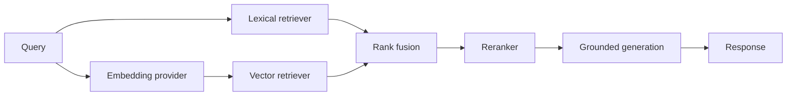

# Architecture

## Implemented Now: Phases 1 and 2

- `core.config.Settings` owns typed application settings. Environment variables prefixed with `SUPPORT_ASSISTANT_` override development defaults; a local `.env` is read through `pydantic-settings`.
- `main.create_app()` is the application factory. It receives settings and an optional LLM provider, configures logging, mounts routers, and registers API exception handlers. No model is created at import time.
- The health route is intentionally fast and checks only that the API process is serving requests.
- Request context middleware accepts a syntactically valid UUID `X-Request-ID`, otherwise creates one, binds it to structured logs, and returns it on every HTTP response.
- Application exceptions have a stable JSON error envelope. Unexpected exceptions are logged server-side and return a generic message.
- Provider and retriever protocols describe the future integration points. There are no vendor-specific clients or retrieval algorithms in this phase.
- FAQ Pydantic schemas are separate from SQLAlchemy 2.x models. One `faqs` row keeps question and answer together as an atomic knowledge item, with metadata, tags, status, timestamps, and a deterministic duplicate key.
- The async session factory uses the configured URL. FastAPI dependencies own request-scoped transactions; application startup does not create tables or connect to the database. Alembic owns schema changes.
- `FAQRepository` is the persistence contract; `SqlAlchemyFAQRepository` is its implementation. `KnowledgeBaseService` coordinates create/list/get/update/deactivate and ingestion without depending on SQLAlchemy query construction.
- JSON and JSONL loaders feed per-record validation and normalization. A malformed record is reported and skipped while valid records in the same batch continue.
- FAQ duplicate identity is normalized question + product + version, case-insensitive. The first normalized occurrence in a batch wins; records already in storage are counted as duplicates and not rewritten. A database unique key also protects this identity.
- `EvaluationExample` and the JSONL loader define query, relevant FAQ IDs, optional filters, difficulty, and notes for later Recall@K, Precision@K, MRR, hit-rate, reranker, and abstention evaluation. No metrics are implemented now.

## Planned Later

The intended retrieval flow is:

Lexical search, vector search, fusion, reranking, embeddings, and generation will be implemented behind testable service boundaries in later phases. The API layer will depend on application services, not on the chosen algorithm or provider.

## Swappable Components

- `generation.providers.LLMProvider` returns a typed `GenerationResult`; local Ollama, hosted providers, and other models can implement the same async `generate` contract.
- `retrieval.embeddings.EmbeddingProvider` separates document and query embedding operations from any concrete embedding model.
- `retrieval.bm25_search.LexicalRetriever` and `retrieval.vector_search.VectorRetriever` return common `RetrievalCandidate` values. The vector contract receives an embedding, leaving model selection separate from vector storage.
- `retrieval.reranker.Reranker` reorders common candidates without depending on a particular reranking model.
- `Settings` centralizes provider, model, and top-K selections. Phase 1 uses `not-configured` placeholders and does not choose or load models.

Implementations can therefore change through configuration and dependency injection without changing business logic or route handlers. Contracts are intentionally narrow.

## Phase 2 Ingestion Behavior

`POST /knowledge-base/faqs/bulk` accepts at most 1,000 JSON FAQ records; file ingestion is kept in the CLI, not exposed as an upload endpoint. The CLI accepts UTF-8 `.json` arrays or `.jsonl` files. A malformed JSONL line becomes a structured validation error and does not stop other records; invalid JSON documents and unsupported encodings fail the file load.

Whitespace at field edges is trimmed; runs of whitespace within each question/answer line are collapsed while paragraph breaks are retained. Empty metadata becomes null, and tags are trimmed and deduplicated case-insensitively. Invalid records are never silently discarded: the result includes record number, field, code, and a safe message. `accepted_records` counts valid records, including duplicates; `rejected_records` counts validation errors; duplicates are reported separately. Ingestion persists new valid records together in the request/CLI transaction.

No embeddings, lexical/vector search, fusion, reranking, model clients, generation, confidence scoring, or automatic answers are implemented in Phase 2.
